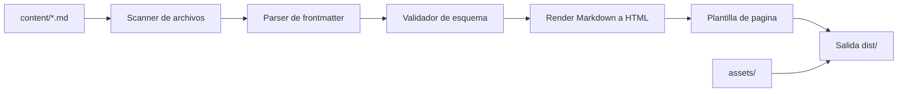

# Arquitectura

## Vision general
El sistema sigue un flujo simple: detectar contenido Markdown, validarlo, convertirlo a HTML y escribir una salida estatica lista para servir.

## Componentes propuestos
### 1. Scanner
Recorre la carpeta de contenido, identifica archivos publicables y arma la lista de entradas.

### 2. Parser de metadatos
Lee el frontmatter y transforma el contenido en una estructura de datos interna.

### 3. Validador
Comprueba que existan los campos obligatorios y que el formato sea consistente.

### 4. Renderizador Markdown
Convierte el cuerpo del articulo a HTML usando el motor Markdown elegido.

### 5. Motor de plantillas
Inserta el contenido renderizado dentro de una pagina base con cabecera, navegacion, metadatos y pie.

### 6. Ensamblador del sitio
Crea la portada, las paginas de entrada, los archivos de categoria y la copia de assets.

## Flujo de build
1. Leer configuracion global.
2. Buscar entradas y paginas.
3. Validar frontmatter y rutas de assets.
4. Renderizar cada entrada.
5. Generar indices y listados.
6. Copiar recursos estaticos.
7. Emitir la carpeta de salida.

## Estructura tecnica sugerida
- `content/` para fuentes Markdown.
- `templates/` para HTML base y componentes reutilizables.
- `assets/` para CSS, JS, imagenes y fuentes.
- `scripts/` para el generador Python.
- `dist/` para el resultado final.

## Consideraciones
- El algoritmo debe ser determinista para que dos builds iguales produzcan la misma salida.
- Los assets deben quedar referenciados con rutas estables.
- El sitio debe soportar una base URL configurable para despliegues en subcarpetas.
- El modo local debe permitir depuracion sin publicar.
